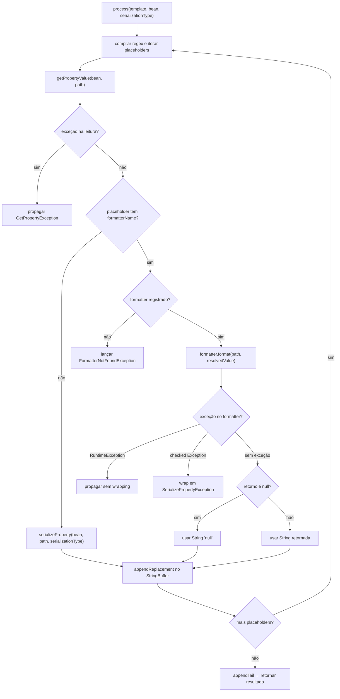

# Design Document: custom-formatter

## Overview

A feature **custom-formatter** adiciona suporte a formatadores customizados no `TemplateEngine`. O usuário registra instâncias de `CustomFormatter` no engine via `engine.registerFormatter("nome", formatter)`, e as referencia diretamente na sintaxe do template usando `${campo|nomeDoFormatter}`.

Quando um placeholder usa a sintaxe `${path|formatterName}`, o pipeline de serialização Gson é bypassado: o valor resolvido via reflection é entregue diretamente ao formatter registrado, e a String retornada é usada como replacement. Placeholders sem formatter (`${path}`) continuam usando o pipeline Gson existente sem qualquer alteração.

O engine passa a ter estado interno: um `Map<String, CustomFormatter>` que persiste entre chamadas a `process`.

---

## Architecture

O fluxo de processamento existente é estendido em dois pontos:

1. **Parsing do placeholder**: a regex passa a capturar opcionalmente o `|formatterName` após o path.
2. **Despacho de serialização**: se o placeholder contém um formatter name, o engine busca o formatter no Map interno e o invoca; caso contrário, usa o pipeline Gson existente.

```
registerFormatter("nome", formatter)
  └─ Map<String, CustomFormatter> interno ← armazena o formatter

process(template, bean, serializationType)
  │
  ├─ Regex: Pattern.compile("\\$\\{([^|{}]+)(?:\\|([^}]+))?\\}")
  │         Grupo 1: path (dot-notation)
  │         Grupo 2: formatterName (opcional)
  │
  ├─ Para cada placeholder encontrado:
  │     │
  │     ├─ getPropertyValue(bean, path)  ← lógica existente, inalterada
  │     │
  │     ├─ Se grupo 2 presente (formatterName):
  │     │     ├─ Busca formatter no Map → não encontrado → lança exceção
  │     │     └─ formatter.format(path, resolvedValue)
  │     │           ├─ RuntimeException → propagada diretamente
  │     │           ├─ checked Exception → wrapped em SerializePropertyException
  │     │           └─ null → "null"
  │     │
  │     └─ Se grupo 2 ausente:
  │           └─ serializeProperty(bean, path, serializationType) ← inalterado
  │
  └─ StringBuffer com appendReplacement/appendTail → resultado final
```

### Diagrama de fluxo (Mermaid)



---

## Components and Interfaces

### CustomFormatter (nova interface)

Interface funcional pública no pacote `io.github.moraesdelima.templateengine`.

```java
@FunctionalInterface
public interface CustomFormatter {
    /**
     * Formats the resolved value of a placeholder.
     *
     * @param propertyName  the dot-notation path of the placeholder (e.g. "cliente.endereco.rua")
     * @param resolvedValue the value resolved via reflection; may be {@code null}
     * @return the String to be inserted in the template; if {@code null} is returned,
     *         the engine will insert the literal String {@code "null"}
     * @throws Exception if formatting fails; checked exceptions will be wrapped
     *                   in {@link SerializePropertyException}
     */
    String format(String propertyName, Object resolvedValue) throws Exception;
}
```

### FormatterNotFoundException (nova exceção)

Exceção checked lançada quando um placeholder referencia um formatter não registrado. Estende `TemplateEngineException` seguindo a hierarquia existente.

```java
@Getter
public class FormatterNotFoundException extends TemplateEngineException {
    private final String formatterName;

    public FormatterNotFoundException(String formatterName) {
        super("Formatter not registered: " + formatterName);
        this.formatterName = formatterName;
    }
}
```

### TemplateEngine (existente — estendido)

**Novo campo de estado interno**

```java
private final Map<String, CustomFormatter> formatters = new HashMap<>();
```

**Novo método público `registerFormatter`**

```java
/**
 * Registers a custom formatter under the given name.
 * The formatter can be referenced in templates using the syntax ${path|name}.
 *
 * @param name      the formatter identifier (must not be null or empty)
 * @param formatter the formatter implementation (must not be null)
 * @throws IllegalArgumentException if name is null/empty or formatter is null
 */
public void registerFormatter(String name, CustomFormatter formatter) {
    if (name == null || name.isEmpty()) {
        throw new IllegalArgumentException("formatter name must not be null or empty");
    }
    if (formatter == null) {
        throw new IllegalArgumentException("formatter must not be null");
    }
    formatters.put(name, formatter);
}
```

**Alteração no método `process(String template, Object bean, int serializationType)`**

A regex é atualizada para capturar o `formatterName` opcional. O loop de substituição despacha para o formatter ou para o pipeline Gson conforme o grupo capturado.

```java
// Regex atualizada — grupo 1: path, grupo 2: formatterName (opcional)
Pattern pattern = Pattern.compile("\\$\\{([^|{}]+)(?:\\|([^}]+))?\\}");
```

**Novo método privado `applyFormatter`**

```java
private String applyFormatter(CustomFormatter formatter, String property,
        Object resolvedValue, Class<?> beanClass)
        throws SerializePropertyException {
    try {
        String result = formatter.format(property, resolvedValue);
        return result == null ? "null" : result;
    } catch (RuntimeException e) {
        throw e;
    } catch (Exception e) {
        throw new SerializePropertyException(property, beanClass, e);
    }
}
```

**Métodos existentes — sem alteração de assinatura ou comportamento**

- `process(String template, Object bean)` — inalterado
- `serializeProperty(...)` — inalterado
- `getPropertyValue(...)` — inalterado

---

## Data Models

Nenhum modelo de dados de domínio é introduzido. As adições são:

- Interface `CustomFormatter`
- Exceção `FormatterNotFoundException`
- Campo `Map<String, CustomFormatter> formatters` em `TemplateEngine`

### Tabela de comportamentos — placeholders com formatter

| Cenário | Resultado |
|---|---|
| `${nome\|uppercase}` com formatter `uppercase` registrado | `formatter.format("nome", value)` → resultado inserido |
| `${nome\|uppercase}` com formatter `uppercase` NÃO registrado | `FormatterNotFoundException` lançada |
| `${nome}` sem formatter (API existente) | pipeline Gson — comportamento inalterado |
| `formatter.format` retorna `""` | string vazia inserida no template |
| `formatter.format` retorna `null` | string literal `"null"` inserida |
| `formatter.format` lança `RuntimeException` | propagada diretamente |
| `formatter.format` lança checked `Exception` | wrapped em `SerializePropertyException` |
| `registerFormatter` com name null/empty | `IllegalArgumentException` |
| `registerFormatter` com formatter null | `IllegalArgumentException` |
| `registerFormatter` com name já existente | formatter anterior substituído |

### Hierarquia de exceções (atualizada)

```
Exception
└── TemplateEngineException (checked)
    ├── GetPropertyException         → falha na leitura (reflection)
    ├── SerializePropertyException   → falha na serialização ou no formatter (checked)
    └── FormatterNotFoundException   → formatter referenciado não está registrado
```

---

## Correctness Properties

*A property is a characteristic or behavior that should hold true across all valid executions of a system — essentially, a formal statement about what the system should do. Properties serve as the bridge between human-readable specifications and machine-verifiable correctness guarantees.*

### Property 1: Formatter registrado é invocado com os argumentos corretos

*For any* bean, template com placeholder `${path|name}` e formatter registrado sob `name`, o engine deve invocar `formatter.format(path, resolvedValue)` onde `resolvedValue` é exatamente o valor obtido via reflection para `path`.

**Validates: Requirements 3.2, 6.1**

### Property 2: Placeholder sem formatter preserva comportamento existente

*For any* template contendo apenas placeholders no formato `${path}` (sem `|formatterName`), o resultado de `process(template, bean, serializationType)` deve ser idêntico ao resultado produzido antes desta feature.

**Validates: Requirements 4.1, 4.2, 4.3, 3.4**

### Property 3: Formatter não registrado lança exceção

*For any* template com placeholder `${path|name}` onde `name` não foi registrado via `registerFormatter`, o engine deve lançar `FormatterNotFoundException` contendo o nome do formatter.

**Validates: Requirements 3.3**

### Property 4: Retorno null do formatter resulta em "null" no template

*For any* formatter que retorna `null` para qualquer entrada, o placeholder correspondente no resultado final deve ser a string literal `"null"`.

**Validates: Requirements 6.2**

### Property 5: Registro substitui formatter anterior

*For any* nome de formatter, registrar um novo formatter sob o mesmo nome e depois processar um template deve usar o formatter mais recentemente registrado.

**Validates: Requirements 2.2**

### Property 6: RuntimeException do formatter é propagada sem wrapping

*For any* formatter que lança uma `RuntimeException`, o engine deve propagar exatamente essa exceção sem encapsulá-la.

**Validates: Requirements 5.1**

### Property 7: Checked exception do formatter é wrapped em SerializePropertyException

*For any* formatter que lança uma checked `Exception`, o engine deve lançar `SerializePropertyException` tendo a exceção original como causa.

**Validates: Requirements 5.2**

---

## Error Handling

| Situação | Exceção | Quando |
|---|---|---|
| Propriedade inexistente no bean | `GetPropertyException` | Durante `getPropertyValue` |
| Formatter referenciado não registrado | `FormatterNotFoundException` | Antes de invocar o formatter |
| `RuntimeException` no formatter | propagada diretamente | Durante `formatter.format` |
| checked `Exception` no formatter | `SerializePropertyException` (com cause) | Durante `formatter.format` |
| `registerFormatter` com name null/empty | `IllegalArgumentException` | Em `registerFormatter` |
| `registerFormatter` com formatter null | `IllegalArgumentException` | Em `registerFormatter` |
| Tipo incompatível com STRING_SERIALIZATION | `SerializePropertyException` | Apenas em placeholders sem formatter |

A ordem de verificação dentro do loop de substituição é:
1. `getPropertyValue` — pode lançar `GetPropertyException`
2. Verificar se há formatterName no placeholder
3. Se sim: buscar no Map → `FormatterNotFoundException` se ausente → invocar formatter
4. Se não: `serializeProperty` com pipeline Gson existente

---

## Testing Strategy

### Abordagem dual: testes unitários + property-based tests

**Testes unitários** cobrem exemplos concretos, casos de borda e condições de erro:
- Registro e substituição de um formatter simples
- Template com múltiplos formatters diferentes
- Placeholder sem formatter ao lado de placeholder com formatter no mesmo template
- Formatter retornando null → "null" no resultado
- Formatter retornando string vazia
- Formatter não registrado → `FormatterNotFoundException`
- `registerFormatter` com argumentos inválidos → `IllegalArgumentException`
- Substituição de formatter registrado (mesmo nome)
- Exceção RuntimeException propagada do formatter
- Exceção checked wrappada em `SerializePropertyException`

**Property-based tests** validam as propriedades universais usando [jqwik](https://jqwik.net/) (biblioteca PBT para Java, compatível com JUnit 4/5):

Cada property test deve rodar com mínimo de 100 iterações e ser anotado com o identificador da propriedade:

```
// Feature: custom-formatter, Property 1: formatter registrado é invocado com os argumentos corretos
// Feature: custom-formatter, Property 2: placeholder sem formatter preserva comportamento existente
// Feature: custom-formatter, Property 3: formatter não registrado lança exceção
// Feature: custom-formatter, Property 4: retorno null do formatter resulta em "null"
// Feature: custom-formatter, Property 5: registro substitui formatter anterior
// Feature: custom-formatter, Property 6: RuntimeException propagada sem wrapping
// Feature: custom-formatter, Property 7: checked exception wrapped em SerializePropertyException
```

**Configuração jqwik**:
- Adicionar dependência `net.jqwik:jqwik` no `pom.xml`
- Cada `@Property` usa `@Report(Reporting.GENERATED)` para rastreabilidade
- Geradores customizados para beans de teste com valores aleatórios de String, int e objetos aninhados
