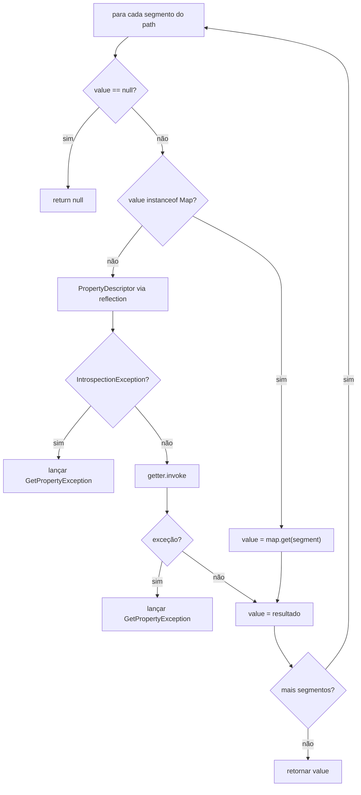

# Design Document: map-property-navigation

## Overview

A mudança é cirúrgica e localizada em um único método: `getPropertyValue` em `TemplateEngine`. A cada iteração do loop de segmentos, antes de tentar usar `PropertyDescriptor`, o engine verifica se o valor atual é uma instância de `Map`. Se sim, usa `map.get(property)` diretamente. Se não, mantém o comportamento existente com reflection.

Nenhuma nova classe, interface ou dependência é necessária.

---

## Architecture

```
getPropertyValue(bean, "retorno.cbo.codigo")
  │
  ├─ segmento "retorno": value é TestBean → não é Map → reflection → retorna Map<String,Object>
  │
  ├─ segmento "cbo": value é Map → map.get("cbo") → retorna Map<String,Object>
  │
  └─ segmento "codigo": value é Map → map.get("codigo") → retorna "1234"
```

```
getPropertyValue(bean, "cliente.nome")
  │
  ├─ segmento "cliente": value é TestBean → não é Map → reflection → retorna Cliente (Bean)
  │
  └─ segmento "nome": value é Cliente → não é Map → reflection → retorna "João"
```

### Diagrama de fluxo (Mermaid)



---

## Components and Interfaces

### TemplateEngine.getPropertyValue (modificado)

Única alteração: adicionar o branch `instanceof Map` no início do loop, antes do `PropertyDescriptor`.

```java
for (String property : nestedProperties) {

    if (value == null) {
        return null;
    }

    // NEW: suporte a Map — usa map.get() em vez de reflection
    if (value instanceof Map) {
        value = ((Map<?, ?>) value).get(property);
        beanClass = value != null ? value.getClass() : Object.class;
        continue;
    }

    // comportamento existente — Java Bean via reflection
    PropertyDescriptor pd;
    try {
        pd = new PropertyDescriptor(property, beanClass);
    } catch (IntrospectionException e) {
        throw new GetPropertyException(property, beanClass, e);
    }
    // ...
}
```

Nenhum outro método é alterado. O `serializeProperty` recebe o valor folha e aplica as regras de serialização normalmente, independente de ter vindo de Map ou Bean.

---

## Data Models

Nenhum modelo novo. O `Map` é tratado como nó de navegação — o engine não impõe restrições sobre o tipo genérico do Map (`Map<String, Object>`, `Map<Object, Object>`, etc.). A chave usada é sempre a String do segmento do path.

### Tabela de comportamentos

| Cenário | Resultado |
|---|---|
| Bean → Bean → String | valor via reflection em cada nível |
| Bean → Map → String | reflection no Bean, map.get() no Map |
| Map → Map → String | map.get() em cada nível |
| Map → Bean → String | map.get() no Map, reflection no Bean |
| Map com chave inexistente | null → "null" no template |
| Map nulo em posição intermediária | null → "null" no template |
| Bean com propriedade inexistente | GetPropertyException |

---

## Error Handling

- Chave inexistente no Map: `map.get(key)` retorna `null` → null-safe navigation retorna `null` → template recebe `"null"`. Sem exceção.
- Map nulo em posição intermediária: coberto pelo check `value == null` existente → retorna `null`.
- Propriedade inexistente em Bean: comportamento inalterado → `GetPropertyException`.
- Tipo de chave incompatível: `map.get(stringKey)` em Map com chaves não-String retorna `null` (sem ClassCastException em Java generics com raw types) → tratado como chave inexistente.
