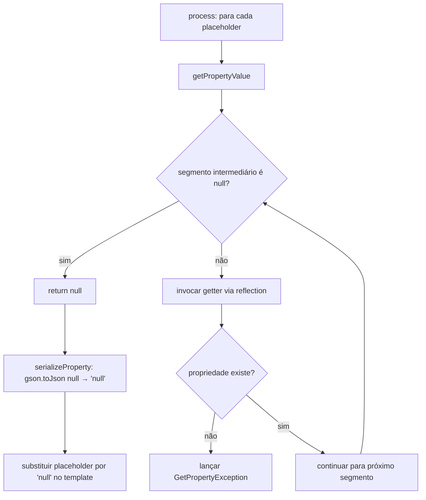

# Design Document: null-safe-path-navigation

## Overview

A feature **null-safe-path-navigation** altera o comportamento do `TemplateEngine` ao navegar por paths com dot-notation quando um segmento intermediário possui valor `null`. Em vez de lançar `GetPropertyException`, o engine retorna a string `"null"` como resultado da substituição do placeholder.

A mudança já foi aplicada no código: o método `getPropertyValue` agora retorna `null` (em vez de lançar exceção) quando encontra `value == null` durante a iteração pelos segmentos do path. O `serializeProperty` já trata `null` corretamente via `gson.toJson(null)` → `"null"`.

O escopo do design cobre:
- A lógica de navegação null-safe já implementada em `getPropertyValue`
- A atualização do teste de regressão existente
- Novos testes para cobrir os cenários null-safe com ambos os tipos de serialização

---

## Architecture

O fluxo de processamento permanece inalterado. A única mudança comportamental está dentro de `getPropertyValue`, no loop de iteração dos segmentos do path:

```
getPropertyValue(bean, "cliente.nome")
  │
  ├─ segmento "cliente": getter invocado → retorna null
  │
  ├─ próxima iteração: value == null → return null  ← NOVO COMPORTAMENTO
  │
  └─ (antes lançava GetPropertyException)
```

O `null` retornado por `getPropertyValue` é passado para `serializeProperty`, que chama `gson.toJson(null)` → `"null"` (string). Esse valor é usado como replacement no template.

```
process("O nome é ${cliente.nome}", bean, JSON_SERIALIZATION)
  │
  ├─ getPropertyValue(bean, "cliente.nome") → null  (cliente é null)
  │
  ├─ serializeProperty: gson.toJson(null) → "null"
  │
  └─ resultado: "O nome é null"
```

### Diagrama de fluxo (Mermaid)



---

## Components and Interfaces

### TemplateEngine (existente — modificado)

**Método `getPropertyValue` (privado)**

Comportamento anterior:
```java
// Lançava GetPropertyException quando value == null durante iteração
```

Comportamento atual (já implementado):
```java
for (String property : nestedProperties) {
    if (value == null) {
        return null;  // null-safe: retorna null em vez de lançar exceção
    }
    // ... reflection para obter o getter
}
```

**Método `serializeProperty` (privado) — sem alteração**

Já trata `null` corretamente:
- `gson.toJson(null)` → `"null"`
- `JSON_SERIALIZATION`: retorna `"null"`
- `STRING_SERIALIZATION`: o branch `serializedProperty.startsWith("\"")` não se aplica; o branch `!startsWith("{") && !startsWith("[")` captura `"null"` e retorna como está

### TemplateEngineTest (existente — a ser atualizado)

O teste `test_replacing_a_property_with_a_null_parent_with_TemplateEngine_JSON_SERIALIZATION` precisa ser convertido de um teste de exceção para um teste de substituição bem-sucedida. Além disso, deve ser adicionado o teste equivalente para `STRING_SERIALIZATION`.

---

## Data Models

Nenhum modelo de dados novo é introduzido. Os modelos existentes permanecem inalterados:

### GetPropertyException
```java
// Lançada apenas quando a propriedade não existe no bean (IntrospectionException)
// ou quando o getter não é acessível
// NÃO é mais lançada para segmentos intermediários null
public class GetPropertyException extends TemplateEngineException {
    private final String property;
    private final Class<?> beanClass;
}
```

### Tabela de comportamentos atualizada

| Cenário | STRING_SERIALIZATION | JSON_SERIALIZATION |
|---|---|---|
| String `"João"` | `João` | `"João"` |
| int `32` | `32` | `32` |
| null (valor direto) | `null` | `null` |
| **Parent null em path aninhado** | **`null`** ← alterado | **`null`** ← alterado |
| Propriedade inexistente | lança `GetPropertyException` | lança `GetPropertyException` |
| Object `{...}` | lança `SerializePropertyException` | `{"campo":"valor"}` |

---

## Correctness Properties

*A property is a characteristic or behavior that should hold true across all valid executions of a system — essentially, a formal statement about what the system should do. Properties serve as the bridge between human-readable specifications and machine-verifiable correctness guarantees.*

### Property 1: Null-safe navigation retorna "null"

*For any* bean, path com dot-notation onde qualquer segmento intermediário possui valor `null`, e qualquer tipo de serialização (`STRING_SERIALIZATION` ou `JSON_SERIALIZATION`), o `TemplateEngine` deve substituir o placeholder pela string `"null"` sem lançar exceção.

Raciocínio: 1.1 cobre o comportamento geral; 1.2 e 1.3 são especializações por `serializationType`; 2.1 é especialização por profundidade. Todos são subsumos desta propriedade universal parametrizada por serializationType e profundidade do path.

**Validates: Requirements 1.1, 1.2, 1.3, 2.1**

---

### Property 2: Isolamento entre placeholders

*For any* template com múltiplos placeholders onde apenas um possui segmento intermediário `null`, o `TemplateEngine` deve substituir somente o placeholder afetado por `"null"` e processar os demais normalmente, retornando seus valores corretos.

Raciocínio: A presença de `null` em um placeholder não deve contaminar o processamento dos outros. Podemos gerar templates com N placeholders, setar um segmento como null, e verificar que os N-1 restantes foram substituídos corretamente.

**Validates: Requirements 1.4**

---

### Property 3: GetPropertyException para propriedades inexistentes

*For any* bean e qualquer nome de propriedade que não existe nesse bean, o `TemplateEngine` deve lançar `GetPropertyException` contendo exatamente o nome da propriedade que falhou e a classe exata do bean onde a falha ocorreu.

Raciocínio: 1.5, 3.1, 3.2 e 3.3 testam o mesmo comportamento — lançamento de exceção + conteúdo correto. Combinados em uma única propriedade que verifica tanto o tipo da exceção quanto seus campos `property` e `beanClass`.

**Validates: Requirements 1.5, 3.1, 3.2, 3.3**

---

### Property 4: Comportamento normal preservado para paths profundos sem null

*For any* bean com path de profundidade 3 ou mais onde nenhum segmento é `null`, o `TemplateEngine` deve retornar o valor correto da propriedade final, sem alteração de comportamento em relação a paths mais rasos.

Raciocínio: A mudança null-safe não deve afetar o caminho feliz. Paths profundos sem null devem continuar funcionando normalmente.

**Validates: Requirements 2.2**

---

## Error Handling

### Propriedades inexistentes — comportamento preservado

`GetPropertyException` continua sendo lançada quando:
- A propriedade não existe no bean (`IntrospectionException` ao criar `PropertyDescriptor`)
- O getter não é acessível (`getter == null`)

A exceção carrega `property` (nome exato da propriedade que falhou) e `beanClass` (classe exata onde a falha ocorreu), permitindo diagnóstico preciso.

### Segmentos intermediários null — novo comportamento

Quando `value == null` durante a iteração dos segmentos do path, `getPropertyValue` retorna `null` imediatamente. O `serializeProperty` converte esse `null` em `"null"` via `gson.toJson(null)`. Nenhuma exceção é lançada.

### Serialização de tipos incompatíveis — comportamento preservado

`SerializePropertyException` continua sendo lançada para `STRING_SERIALIZATION` quando o valor é um objeto complexo ou array. Não há interação com a feature null-safe.

---

## Testing Strategy

### Abordagem dual: testes unitários + testes baseados em propriedades

Os dois tipos são complementares e ambos são necessários:
- **Testes unitários**: exemplos específicos, casos de regressão, condições de erro concretas
- **Testes de propriedade**: validação universal das propriedades formais com inputs gerados aleatoriamente

### Testes unitários (exemplos e regressão)

Focados em:
- Exemplo específico: `testBean.cliente = null`, template `"${cliente.nome}"`, resultado `"null"` com `JSON_SERIALIZATION` (Requirement 4.1)
- Exemplo específico: `testBean.cliente = null`, template `"${cliente.nome}"`, resultado `"null"` com `STRING_SERIALIZATION` (Requirement 4.2)
- Atualização do teste de regressão `test_replacing_a_property_with_a_null_parent_with_TemplateEngine_JSON_SERIALIZATION`: converter de `testReplacePropertiesThrowsAnException` para `testReplaceProperties` (Requirement 4.3)
- Casos de borda: path com profundidade 3 (`a.b.c`) com segmento intermediário null

### Testes baseados em propriedades (property-based testing)

**Biblioteca**: [jqwik](https://jqwik.net/) — biblioteca de property-based testing para Java, integrada com JUnit 5. Alternativa: [QuickTheories](https://github.com/quicktheories/QuickTheories) para JUnit 4 (compatível com a estrutura atual do projeto que usa JUnit 4).

> Nota: o projeto usa JUnit 4 (`org.junit.Test`). Recomenda-se **QuickTheories** para manter compatibilidade, ou migrar para JUnit 5 + jqwik.

Cada propriedade deve ser implementada por um único teste de propriedade com mínimo de **100 iterações**.

**Configuração de tags** (comentário em cada teste):
```
// Feature: null-safe-path-navigation, Property {N}: {texto da propriedade}
```

#### Property 1 — Null-safe navigation retorna "null"
```java
// Feature: null-safe-path-navigation, Property 1: null-safe navigation retorna "null"
// Para qualquer bean com segmento intermediário null e qualquer serializationType,
// o resultado deve ser "null"
```
Gerador: criar instâncias de `TestBean` com `cliente` setado como `null`, variar o `serializationType` entre `STRING_SERIALIZATION` e `JSON_SERIALIZATION`, verificar que `process("${cliente.nome}", bean, type)` retorna `"null"`.

#### Property 2 — Isolamento entre placeholders
```java
// Feature: null-safe-path-navigation, Property 2: isolamento entre placeholders
// Para qualquer template com múltiplos placeholders onde um tem segmento null,
// os demais devem ser processados normalmente
```
Gerador: template com `${registro}` (válido) e `${cliente.nome}` (cliente null), verificar que `registro` é substituído corretamente e `cliente.nome` retorna `"null"`.

#### Property 3 — GetPropertyException para propriedades inexistentes
```java
// Feature: null-safe-path-navigation, Property 3: GetPropertyException para propriedades inexistentes
// Para qualquer nome de propriedade inexistente, deve lançar GetPropertyException
// com property e beanClass corretos
```
Gerador: strings aleatórias que não correspondem a nenhuma propriedade de `TestBean`, verificar que `GetPropertyException` é lançada com `property` e `beanClass` corretos.

#### Property 4 — Comportamento normal preservado para paths profundos sem null
```java
// Feature: null-safe-path-navigation, Property 4: comportamento normal para paths profundos sem null
// Para qualquer bean com path de profundidade >= 3 sem null,
// o valor correto deve ser retornado
```
Gerador: instâncias de `TestBean` com `cliente` e `endereco` não-null, verificar que `process("${cliente.endereco.rua}", bean, type)` retorna o valor correto de `rua`.

### Cobertura esperada

| Requirement | Tipo de teste | Cobertura |
|---|---|---|
| 1.1, 1.2, 1.3 | Property 1 | ✅ |
| 1.4 | Property 2 | ✅ |
| 1.5, 3.1, 3.2, 3.3 | Property 3 | ✅ |
| 2.1 | Property 1 (path profundo com null) | ✅ |
| 2.2 | Property 4 | ✅ |
| 4.1, 4.2 | Testes unitários de exemplo | ✅ |
| 4.3 | Atualização do teste de regressão | ✅ |
